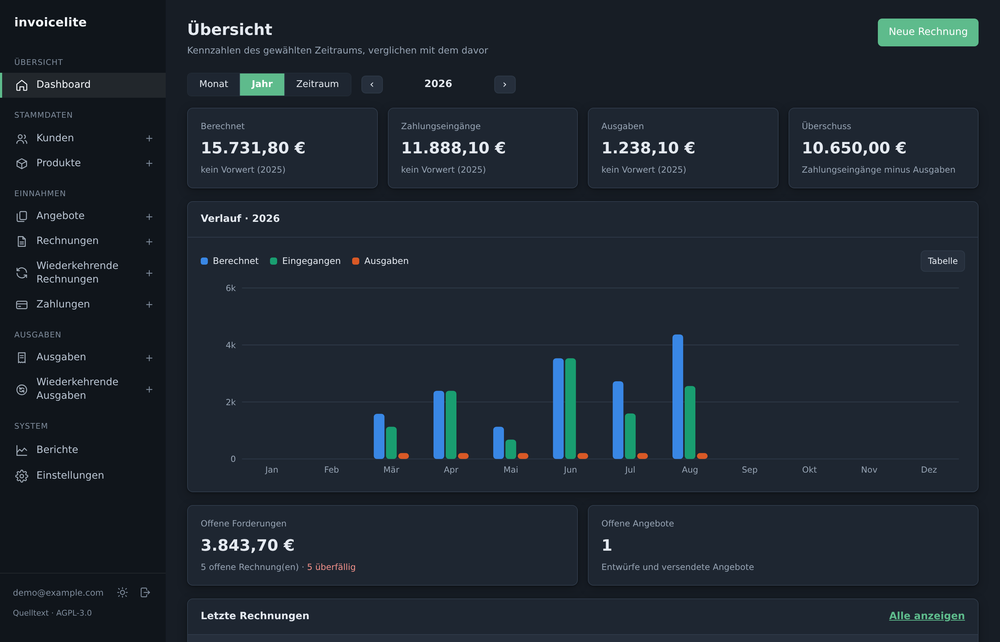
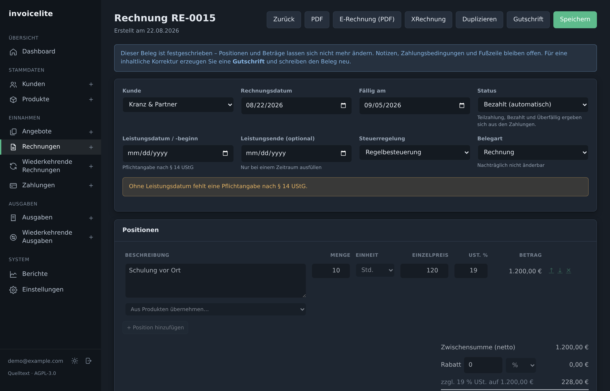
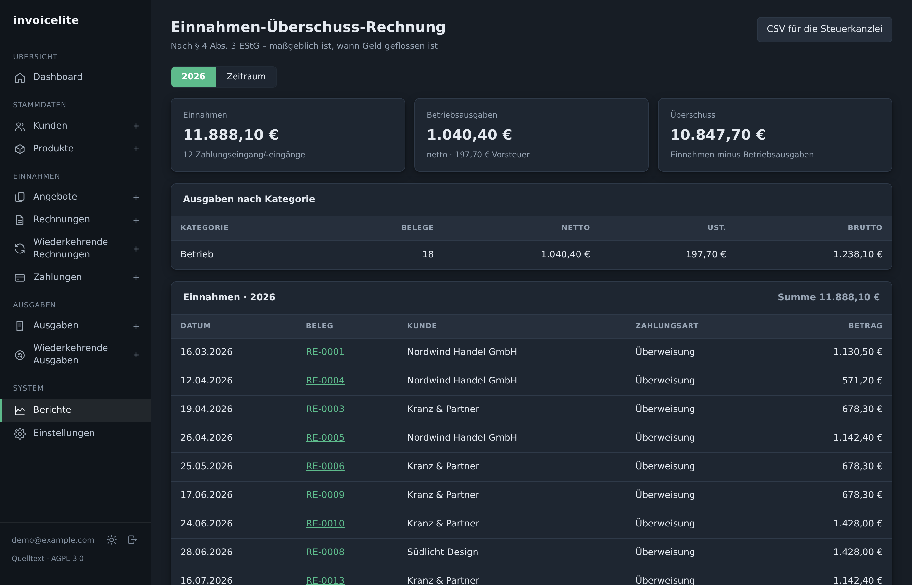

# invoicelite

**Rechnungen, Angebote und Ausgaben für deutsche Kleinunternehmen – in einem einzigen
Docker-Container.**

Kein separater Datenbank-, Webserver- oder Queue-Dienst. Express liefert API und Oberfläche
über denselben Port aus, die Daten liegen in einer SQLite-Datei im Volume. Ein `docker
compose up -d`, und es läuft.

[](https://github.com/Freecat7/invoicelite/actions/workflows/ci.yml)
[](LICENSE)



## Warum

Die meisten Rechnungsprogramme sind entweder ein Abo in fremder Hand oder eine Installation
aus fünf Containern. invoicelite liegt dazwischen: läuft auf dem eigenen Server, hält sich
an deutsches Rechnungsrecht und passt in eine Compose-Datei.

Konkret bedeutet „hält sich an deutsches Recht":

- **XRechnung und ZUGFeRD** – gegen den offiziellen
  [KoSIT-Validator](https://github.com/itplr-kosit/validator) geprüft, Konfiguration
  XRechnung 3.0.2. Über alle Steuerregelungen, mit Rabatt, Gutschrift und Hybrid-PDF:
  `Acceptable: 6  Rejected: 0`
- **§ 19 UStG** (Kleinunternehmer), **§ 13b** (Reverse Charge) und Regelbesteuerung – je
  Beleg festgehalten, nicht global. Ein Wechsel ändert alte Belege nicht.
- **GoBD** – freigegebene Belege sind gesperrt, der Nummernkreis bleibt lückenlos, auch wenn
  ein Anlegen fehlschlägt.
- **EPC-QR-Code** auf der Rechnung, **EÜR** nach § 4 Abs. 3 EStG als PDF und CSV für die
  Steuerkanzlei.

## Schnellstart

```bash
git clone https://github.com/Freecat7/invoicelite.git
cd invoicelite
docker compose up -d --build            # baut beim ersten Mal, dauert ein paar Minuten
docker compose logs | grep Passwort     # Startpasswort ablesen
```

Dann [http://localhost:8080](http://localhost:8080) öffnen. Ein Assistent führt in fünf
Schritten durch Firma, Steuer, Bank, Belege und Zugang – die Einstellungen muss niemand
selbst durchsuchen.

> Für den Betrieb über das Internet gehört ein Reverse Proxy mit TLS davor. Die Anwendung
> selbst spricht HTTP. Siehe [SECURITY.md](SECURITY.md).

## Was es kann

| | |
| --- | --- |
| Belege | Angebote, Rechnungen, Gutschriften, wiederkehrende Rechnungen |
| Versand | SMTP, automatisch am Tag nach der Freigabe – mit Kopie im Ordner „Gesendet" |
| Auswertung | Übersicht nach Monat, Jahr oder freiem Zeitraum; EÜR fürs Finanzamt |
| Schnittstelle | Vollständige REST-API mit Token, dokumentiert in den Einstellungen |
| Sonstiges | Ausgaben mit Belegupload, EPC-QR, Sicherung als ZIP, helles und dunkles Schema |

<table>
<tr>
<td></td>
<td></td>
</tr>
<tr>
<td align="center"><sub>Rechnung bearbeiten</sub></td>
<td align="center"><sub>Einnahmen-Überschuss-Rechnung</sub></td>
</tr>
</table>

## Für wen es nicht gemacht ist

Ehrlichkeit spart Enttäuschung:

- **Ein Konto, eine Firma.** Keine Mandanten, keine Rechteverwaltung, keine Teams.
- **Deutsch.** Oberfläche und Belege sind deutsch, die Steuerlogik bildet deutsches Recht ab.
  Andere Länder sind nicht vorgesehen.
- **Keine Zwei-Faktor-Anmeldung**, kein Kundenportal, keine Zeiterfassung.
- **SQLite.** Ausgelegt auf einen Betrieb mit einem Nutzer, nicht auf eine Agentur mit zwanzig.

Wer davon etwas braucht, ist mit [Invoice Ninja](https://invoiceninja.com) besser bedient.

## In English

A self-hosted invoicing app for **German** small businesses, in a single Docker container.
Produces XRechnung and ZUGFeRD documents validated against the official KoSIT validator,
handles § 19 / § 13b tax regimes, GoBD-compliant document locking and gapless numbering, and
a German income-surplus statement (EÜR) for the tax advisor.

The interface and all documents are in German by design – the software encodes German
invoicing law, so an English interface would not make it useful elsewhere. Not planned.

## Lizenz

Copyright (C) 2026 Lennart Müller

invoicelite steht unter der [Sustainable Use License](LICENSE) – derselben Lizenz, die auch
[n8n](https://github.com/n8n-io/n8n) verwendet. Was das heißt:

- **Im eigenen Betrieb nutzen und anpassen: ja**, auch geschäftlich.
- **Weitergeben: ja**, solange kostenlos und nicht-kommerziell.
- **Als bezahlten Dienst für Dritte betreiben: nein.**

Das ist bewusst kein Open Source im Sinne der OSI – der Quelltext liegt offen, aber niemand
soll die Arbeit hosten und dafür Geld verlangen. Verbindlich ist der [Lizenztext](LICENSE),
die Aufzählung oben ist nur eine Zusammenfassung.

Ohne jede Gewährleistung, auch nicht für Marktreife oder Eignung für einen bestimmten Zweck.

## Mitwirken

Siehe [CONTRIBUTING.md](CONTRIBUTING.md). Kurz: erst ein Issue, dann der Pull Request, und
die Testreihe (`scripts/api-test.py`, derzeit 268 Prüfungen) muss durchlaufen.

---

## Handbuch

Alle Bereiche im Einzelnen – Steuerregelungen, E-Rechnung, Mailversand, GoBD, Sicherung,
API, Umgebungsvariablen, Entwicklung: **[docs/handbuch.md](docs/handbuch.md)**
